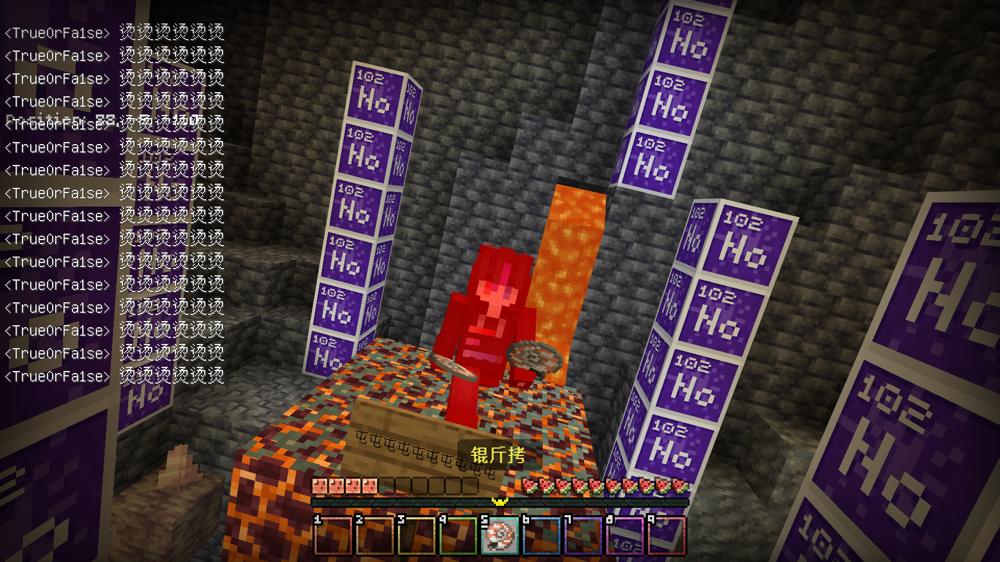

# blog-imgs

我的图床

$$\color{darkblue}\colorbox{CAEBFB}{\large\boxed{\texttt{洛谷颜色对照表}}}$$

$$
\def\arraystretch{1.2}
\begin{array}{|c|l|l||c|l|l|} \hline
颜色名称 & 十六进制编码 & \text{RGB对应值} & 颜色名称 & 十六进制编码 & \text{RGB对应值}  \\ \hline
\color{#52C41A}\text{AC绿} & \text{52C41A} & \text{(82,196,26)} & \color{#FE4C61}\text{入门红} & \text{FE4C61} & \text{(254,76,97)} \\ \hline
\color{#E74C3C}\text{WA红} & \text{E74C3C} & \text{(231,76,60)} & \color{#F39C11}\text{普及-橙} & \text{F39C11} & \text{(243,156,17)} \\ \hline
\color{#9D3DCF}\text{RE紫} & \text{9D3DCF} & \text{(157,61,207)} & \color{#FFC116}\text{普及黄} & \text{FFC116} & \text{(255,193,22)}\\ \hline
\color{#FADB14}\text{CE黄} & \text{FADB14} & \text{(250,219,20)} & \color{#52C41A}\text{普及+提高 绿} & \text{52C41A} & \text{(82,196,26)} \\ \hline
\color{#052242}\text{TLE黑} & \text{052242} & \text{(5,34,66)} & \color{#3498DB}\text{提高+省选-蓝} & \text{3498DB} & \text{(52,152,219)} \\ \hline
\color{#052242}\text{MLE黑} & \text{052242} & \text{(5,34,66)} & \color{#9D3DCF}\text{省选紫} & \text{9D3DCF} & \text{(157,61,207)}  \\ \hline
\color{#052242}\text{OLE黑} & \text{052242} & \text{(5,34,66)} & \color{#0E1D69}\text{NOI黑} & \text{0E1D69} & \text{(14,39,105)}   \\ \hline
\color{#0E1D69}\text{UKE蓝} & \text{0E1D69} & \text{(14,29,105)} & \color{#BFBFBF}\text{未评定灰} & \text{BFBFBF} & \text{(191,191,191)} \\ \hline \hline 
\color{#8E44AD}\text{紫名} & \text{8E44AD} & \text{(142,68,173)} & \color{#52C41A}\text{排行绿} & \text{52C41A} & \text{(82,196,26)} \\ \hline
\color{#E74C3C}\text{红名} & \text{E74C3C} & \text{(231,76,60)} & \color{#F39C11}\text{排行橙} & \text{F39C11} & \text{(243,156,17)} \\ \hline
\color{#E67E22}\text{橙名} & \text{E67E22} & \text{(230,126,34)} & \color{#FADB14}\text{排行黄} & \text{FADB14} & \text{(250,219,20)} \\ \hline
\color{#5EB95E}\text{绿名} & \text{5EB95E} & \text{(94,185,94)} & \color{#E74C3C}\text{排行红} & \text{E74C3C} & \text{(231,76,60)}\\ \hline
\color{#0E90D2}\text{蓝名} & \text{0E90D2} & \text{(14,144,210)} & \color{#52C41A}\text{通过钩绿} & \text{52C41A} & \text{(82,196,26)} \\ \hline
\color{#BFBFBF}\text{灰名} & \text{BFBFBF} & \text{(191,191,191)} & \color{#E74C3C}\text{不通过叉红} & \text{E74C3C} & \text{(231,76,60)} \\ \hline
\hline 
\color{#E74C3C}\text{吉利红} & \text{E74C3C} & \text{(231,76,60)} & \color{#E74C3C}\text{官方比赛红} & \text{E74C3C} & \text{(231,76,60)} \\ \hline
\color{#5EB95E}\text{中平绿} & \text{5EB95E} & \text{(94,185,94)} & \color{#054310}\text{团队比赛绿} & \text{054310} & \text{(5,67,16)} \\ \hline
\color{#000000}\text{凶兆黑} & \text{000000} & \text{(0,0,0)} & \color{#3498DB}\text{个人比赛蓝} & \text{3498DB} & \text{(52,152,219)} \\ \hline \hline
\color{#8E44AD}\text{ACM制紫} & \text{8E44AD} & \text{(142,68,173)} & \color{#5EB95E}\text{Rated绿} & \text{5EB95E} & \text{(94,185,94)} \\ \hline
\color{#F1C40F}\text{IOI制黄} & \text{F1C40F} & \text{(241,196,15)} & \color{#5EB95E}\text{未开始绿} & \text{5EB95E} & \text{(94,185,94)} \\ \hline
\color{#F1C40F}\text{乐多制黄} & \text{F1C40F} & \text{(241,196,15)} & \color{#E74C3C}\text{已结束红} & \text{E74C3C} & \text{(231,76,60)} \\ \hline
\color{#F39C11}\text{OI制橙} & \text{F39C11} & \text{(243,156,17)} & \color{#52C410}\text{进行中*} & \text{暂时无} & \text{暂时无} \\ \hline \hline
\color{#EFEFEF}\text{背景灰} & \text{EFEFEF} & \text{(239, 239, 239)} & \color{#7F7F7F}\text{小字灰} & \text{7F7F7F} & \text{(127,127,127)} \\ \hline \hline 
\color{#0E90D2}\text{按钮蓝} & \text{0E90D2} & \text{(14,144,210)} & \color{#3498DB}\text{链接蓝} & \text{3498DB} & \text{(52,152,219)} \\ \hline 
\color{#DD514C}\text{按钮红} & \text{DD514C} & \text{(221,81,76)} & \color{#3498DB}\text{通过率蓝} & \text{3498DB} & \text{(52,152,219)} \\ \hline \hline 
\color{#FFE169}\text{金钩黄} & \text{FFE169} & \text{(255,225,105)} & \color{#F5CECD}\text{背景粉} & \text{F5CECD} & \text{(245,206,205)} \\ \hline
\color{#5EB95E}\text{绿钩绿} & \text{5EB95E} & \text{(94,185,94)} & \color{#C9E7C9}\text{背景绿} & \text{C9E7C9} & \text{(201,231,201)} \\ \hline
\color{#3498DB}\text{蓝钩蓝} & \text{3498DB} & \text{(52,152,219)} & \color{#CAEBFB}\text{背景蓝} & \text{CAEBFB} & \text{(202,235,251)} \\ \hline \hline 
\color{#3498DB}\text{题目来源蓝} & \text{3498DB} & \text{(52,152,219)} &\color{#7F7F7F}\text{灰色} & \text{7F7F7F} & \text{(127,127,127)} \\ \hline
\color{#E74C3C}\text{题目算法红} & \text{E74C3C} & \text{(231,76,60)}& \color{#FFFFFF}\text{白色} & \text{FFFFFF} & \text{(255,255,255)} \\ \hline
\color{#52C41A}\text{题目地点绿} & \text{52C41A} & \text{(82,196,26)}& \color{#000000}\text{黑色} & \text{000000} & \text{(0,0,0)} \\ \hline
\end{array}
$$
